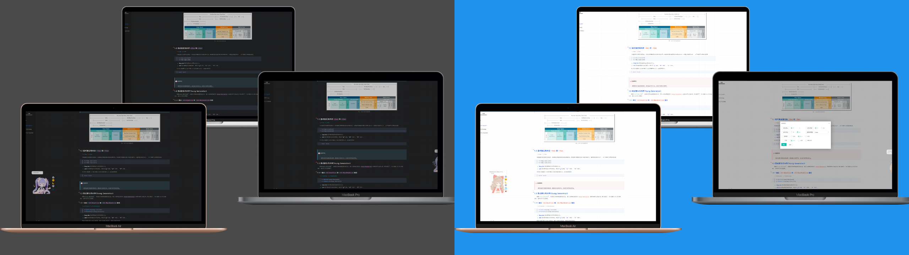
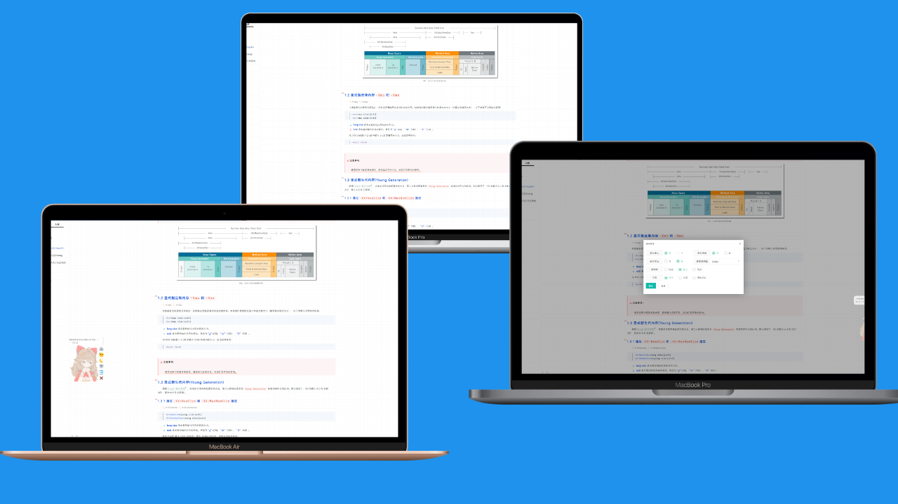
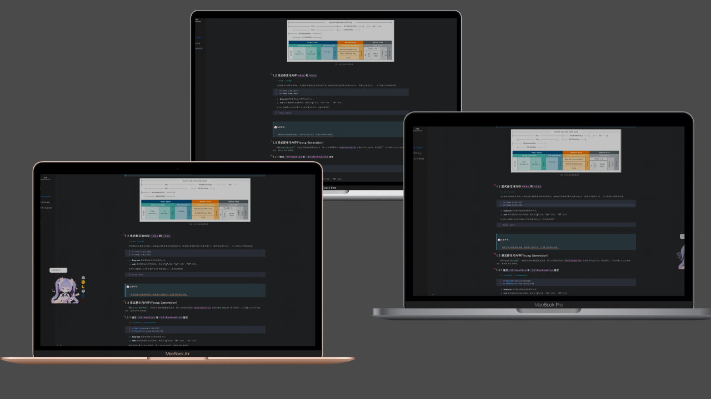
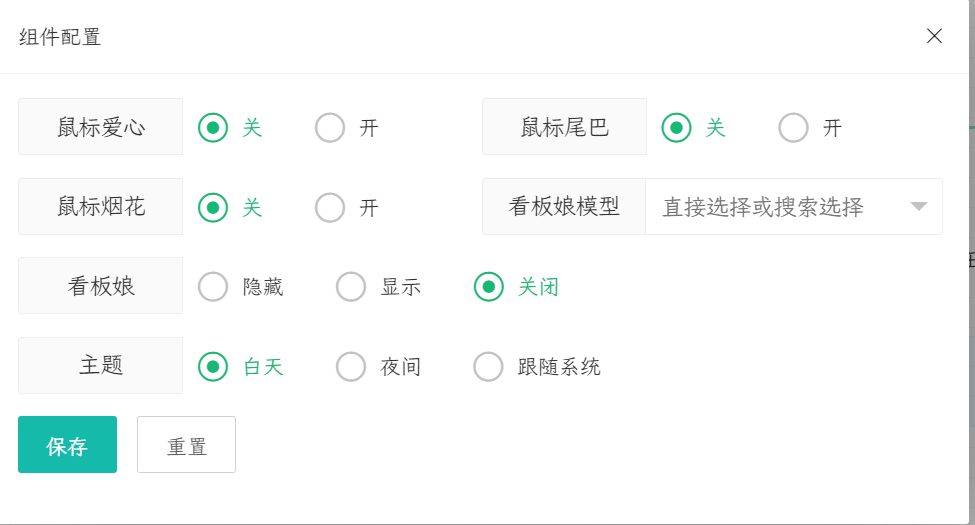

<div align="right"><a title="Chinese" href="./README_CN.md">中文</a></div>

# ymc_typora



Based on [hexo-theme-melody](*https://github.com/Molunerfinn/hexo-theme-melody*)  &   [drake-juejin](https://github.com/liangjingkanji/DrakeTyporaTheme)theme.

## 💻 Installation

### GIT

> If you are in Mainland China, you can download in [Gitee](*https://gitee.com/shawymc/ymc_typora.git*)

Stable branch [recommend]:

```bash
  git clone -b master https://gitee.com/shawymc/ymc_typora.git ymc_typora
```

### Theme
Copy theme files to Typora themes folder:

```text
  {Typora Install Root Directory}\themes
```

### Typora extend
find `{Typora Install Root Directory}\resources\window.html`,search `id="write"` go to `<div id="write" class="ty-before-first-render" contenteditable="false" spellcheck="true" tabindex="-1">` previously added the following codes:
```html
  <script src="xxxUrl/js/autoload-shaw-page-component.min.js"></script>
```

## ⚙ Configuration & Use
1. Open or Restart Typora. Click on `Themes` to switch to `shaw-light`.
2. `File` -> `Preferences` -> `Export` ==> `HTML` ==> `Append in <head/>` add :
```html
  <script src="xxxUrl/js/autoload-shaw-page-component.min.js"></script>
```


## 🎉 Features
- [x] Toolbar: 
  - [x] BackTop.
  - [x] Jump to bottom.
  - [x] Change light🔆 / dark🌒 theme.
  - [x] Change Live2d model.
  - [x] Show or Hide table of Toc.
- [x] Lazyload images. *. Only Support export `HTML`.
- [x] Lazyload `iframe`. *. Only Support export `HTML`.
- [x] Fasxbox for images. *. Only Support export `HTML`.
- [x] FloatBtn for setting:
  - [x] Mouse click effect `heart`.
  - [x] Mouse click effect `firework`.
  - [x] Mouse trail  effect.
  - [x] Live2d setting. Includes model selection and switch.
  - [x] light🔆 / dark🌒 theme change and sync system theme.
-[ ] Others......
## 📷 Screenshots



