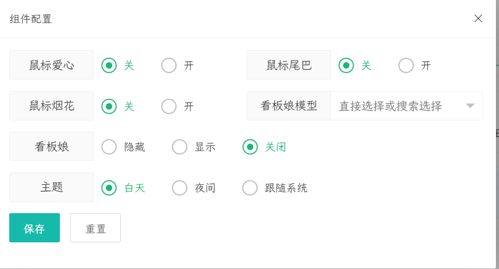

<div align="right"><a title="Chinese" href="./README.md">English</a></div>

# ymc_typora


基于 [hexo-theme-melody](*https://github.com/Molunerfinn/hexo-theme-melody*) 和 [drake-juejin](https://github.com/liangjingkanji/DrakeTyporaTheme) 主题。


## 💻 安装


### GIT


> 如果您位于中国大陆，可以从 [Gitee](*https://gitee.com/shawymc/ymc_typora.git*) 下载


主要分支 [推荐]:


```bash
  git clone -b master https://gitee.com/shawymc/ymc_typora.git ymc_typora
```


### 主题
将主题文件复制到 Typora 主题文件夹中：


```text
  {Typora 安装根目录}\themes
```


### Typora 扩展
找到 `{Typora 安装根目录}\resources\window.html` ，搜索 `id="write"` 并进入 `<div id="write" class="ty-before-first-render" contenteditable="false" spellcheck="true" tabindex="-1">` ，之前添加以下代码：
```html
  <script src="https://cdn.jsdelivr.net/gh/jtcymc/ymc_typora@0.0.4/js/autoload-shaw-page-component.min.js"></script>
```


## ⚙ 配置与使用
1. 打开或重新启动 Typora。单击 `Themes` 切换到 `shaw-light`
2. 在 `文件` -> `偏好设置` -> `导出` ==> `HTML` ==> `在<head/>中添加`：
```html
  <script src="https://cdn.jsdelivr.net/gh/jtcymc/ymc_typora@0.0.4/js/autoload-shaw-page-component.min.js"></script>
```


## 🎉 特点
- [x] 工具栏：
    - [x] 返回顶部。
    - [x] 跳转到底部。
    - [x] 切换浅色🔆 / 深色🌒主题。
    - [x] 更改 Live2d 模型。
    - [x] 展开或收起目录。
- [x] 图像懒加载。*. 仅支持导出`HTML`。
- [x] `iframe`懒加载。*. 仅支持导出`HTML`。
- [x] 图像使用 Fasxbox。*. 仅支持导出`HTML`。
- [x] 悬浮按钮设置：
    - [x] 鼠标点击效果 `heart`。
    - [x] 鼠标点击效果 `firework`。
    - [x] 鼠标拖尾特效。
    - [x] Live2d 设置。包括模型选择和开关。
    - [x] 浅色🔆 / 深色🌒主题更改和同步系统主题。
- [x] 其他......

## demo


 <iframe src="https://jtcymc.github.io/ymc_typora/" style="width:100%;height:700px;border: 1px solid"/>


## 📷 屏幕截图


​			


​			

